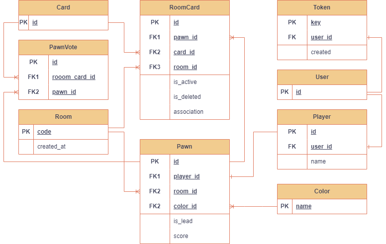

# Imaginarium (backend)

It is impossible to play Imaginarium online for free and without registration. This project provides Base Token Authentication without a password. The project provides an opportunity to play a board game while at a distance.

Backend development is described here.
Frontend development is presented at the link https://github.com/Pololoshka/imaginarium_frontend

Project development status: in development.

## Usage

The project is still in development.

## Development
The project is written in Django Rest Framework.

### Database
***


User data is stored in the PostgreSQL DBMS. The database can be run in Docker Compose. To do this, copy the data from the .env.tests file into the .env file and edit it.

#### Connecting
***


To get started with docker, use the command:

```
docker-compose up db
```

#### Structure
***





### Websockets
***


Django Сhannels are used to handle websockets. The data is stored in the NoSQL DBMS (Redis). To connect to Redis in Docker Compose use the command:

```
docker-compose up redis
```

## To do

:white_check_mark: Building the project architecture: Django Rest Framework.

:white_check_mark: Implementation of Token Based Authentication.

:white_check_mark: Creation of WebSocket Consumer.

:white_check_mark: Creation of the structure of RDBMS models.

:black_square_button: Building the logic of interaction between the backend and the frontend.

:black_square_button: Testing (Pytest).

:black_square_button: Run app in Docker using Docker Compose.


## The project team
[Sokolova Polina — Python developer](https://github.com/Pololoshka)
